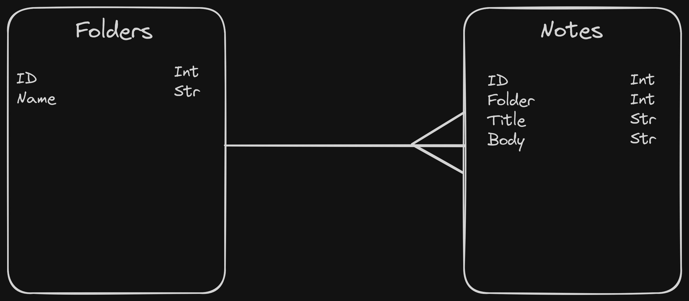
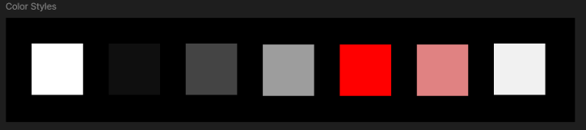

# Development of a Database-Driven Web Application for NCEA Level 3

Project Name: **Secure Notes**

Project Author: **Tom Meldrum**

Assessment Standards: **91902** and **91903**

-------------------------------------------------

## Design, Development and Testing Log

### 20th May 2024

Initial Sketch

Created the initial sketch of the Secure Notes app layout. The design includes basic navigation, note list, and a simple note editor.

The end user (Andrea) mentioned that the sketch looks promising. However, she suggested adding folders to organise notes better as it would help manage different categories of notes more efficiently.

To accommodate the feedback, I will incorporate folders in the design, providing users the ability to categorise notes under different sections. This feature will enhance the organisation and usability of the app.

### 23rd May 2024

Revised Design with Folders

Updated the design to include folders for better note organisation. Added an additional navigation panel to access different folders.

The end user appreciated the inclusion of folders, noting it added to the app's functionality. They also suggested a feature to quickly search for notes within specific folders.

Based on the feedback, I will add a search functionality within the folders. This will allow users to locate notes quickly, improving the overall user experience.

### 28th May 2024

Database Design

Designed the database structure to store user information and notes. The database includes tables for users, notes, and folders.

The end user emphasised the importance of ensuring data security in the database, suggesting encryption for sensitive information and a mechanism to handle failed login attempts securely.

I will implement encryption for the note content and user credentials. Additionally, I will add a feature to track and limit failed login attempts, with a lockout mechanism to protect against brute-force attacks.

### 5th June 2024

Second Figma Prototype

Refined the Figma prototype with a focus on color scheme and added a light mode option based on feedback.

The end user appreciated the inclusion of light mode, highlighting its importance for accessibility. They suggested providing an easy toggle between light and dark modes to accommodate different user preferences.

I will implement a light mode and dark mode toggle feature, allowing users to switch modes seamlessly. This will cater to different lighting conditions and user preferences.

### 9th June 2024

In-App Note Creation Enhancement

Implemented an enhancement where users can add a new note directly while viewing an existing note by clicking a plus symbol.

The end user liked the idea of adding new notes on the fly. They mentioned that it would be useful when needing to jot down quick notes without navigating away from the current note.

I will ensure the plus symbol is prominently placed and easily accessible within the note view, allowing for quick note creation. This feature will enhance the app's efficiency and user experience.

### DATE HERE

Replace this test with what you are working on

Replace this text with brief notes describing what you worked on, any decisions you made, any changes to designs, etc. Add screenshots / links to other media to illustrate your notes where necessary.

> Replace this text with any user feedback / comments

Replace this text with notes describing how you acted upon the user feedback: made changes to design, etc.
