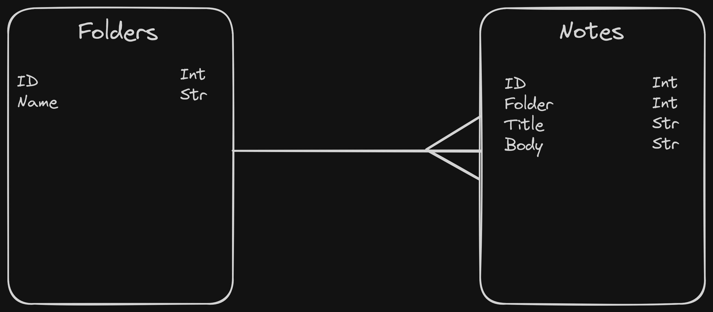
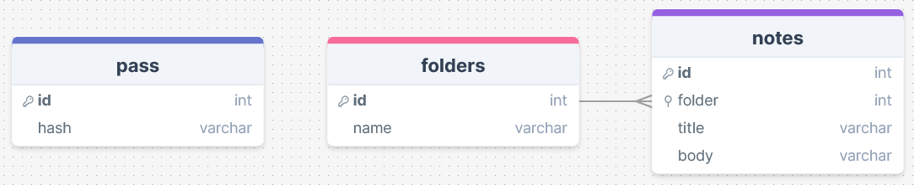
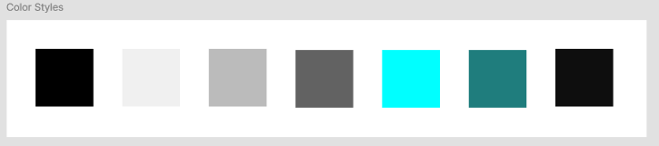
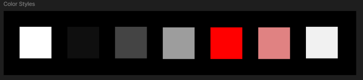

# Development of a Database-Driven Web Application for NCEA Level 3

Project Name: **Secure Notes**

Project Author: **Tom Meldrum**

Assessment Standards: **91902** and **91903**


-------------------------------------------------

## Design, Development and Testing Log


### 20th May 2024

Initial Sketch

Created the initial sketch of the Secure Notes app layout. The design includes basic navigation, note list, and a simple note editor.

>The end user (Andrea) mentioned that the sketch looks terrible, but could be a good app after fleshed out. She suggested adding folders to organise notes better as it would help manage different categories of notes more efficiently.

To accommodate the feedback, I will incorporate folders in the design, providing users the ability to categorise notes under different sections. This feature will enhance the organisation and usability of the app.


### 23rd May 2024

Revised Design with Folders

Updated the design to include folders for better note organisation. Added an additional navigation panel to access different folders.

>The end user appreciated the inclusion of folders, noting it added to the app's functionality. They also suggested a feature to quickly search for notes within specific folders.

Based on the feedback, I will add a search functionality within the folders. This will allow users to locate notes quickly, improving the overall user experience.


### 28th May 2024

Database Design

Designed the database structure to store user information and notes. The database includes tables for users, notes, and folders.

>The end user emphasised the importance of ensuring data security in the database, suggesting encryption for sensitive information and a mechanism to handle failed login attempts securely.

I will implement encryption for the note content and user credentials. Additionally, I will add a feature to track and limit failed login attempts, with a lockout mechanism to protect against brute-force attacks.




### 5th June 2024

Second Figma Prototype

Refined the Figma prototype with a focus on color scheme and added a light mode option based on feedback.

>The end user appreciated the inclusion of light mode, highlighting its importance for accessibility. They suggested providing an easy toggle between light and dark modes to accommodate different user preferences.

I will implement a light mode and dark mode toggle feature, allowing users to switch modes seamlessly. This will cater to different lighting conditions and user preferences.





### 9th June 2024

In-App Note Creation Enhancement

Implemented an enhancement where users can add a new note directly while viewing an existing note by clicking a plus symbol.

>The end user liked the idea of adding new notes on the fly. They mentioned that it would be useful when needing to jot down quick notes without navigating away from the current note. The end user had a look back at the figma, and wanted to see a colour scheme for the light theme. They wanted to have a seamless transition between the light and dark theme. They also would like to see a strength indicator for the password when creating a master password.

I will ensure the plus symbol is prominently placed and easily accessible within the note view, allowing for quick note creation. This feature will enhance the app's efficiency and user experience. I plan on making the light theme more appealing by adding a colour scheme to it. I will also add a strength indicator for the password when creating a master password. This will help users create a strong password to protect their notes.


## **User Feedback and Response Log**

### **June 12th:**

**User Feedback:**

- Form layout: Input boxes are cramped and hard to use on small screens. Fields don’t align with the form area, making it hard to see when typing.
- Colour contrast: Dark mode is good, but some text is hard to read, especially in the forms. The contrast between text and background needs improvement.

**Response:**

- **June 13th - June 18th:**
    - Form layout adjustments: Based on feedback, the form layout was adjusted. Input boxes were enlarged and styled correctly to fit within the form area. Visibility and ease of navigation on smaller screens were prioritized. The changes were tested on a range of screen sizes for confirmation.
    - Improved colour contrast: The contrast between text and background colours in dark mode was improved, especially in the forms. Text brightness was increased, and the background was toned down. I also made dark mode the default and later removed the toggle feature entirely after the end user expressed a preference for dark mode. The toggle feature was not correctly implemented to a good enough degree to be worth keeping.

### **June 15th:**

**User Feedback:**

- Folder management: It is hard to manage folders as there is no clear way to edit or delete them from the homepage. Navigating through multiple pages to make simple changes is cumbersome.
- Theme consistency: The theme toggle between light and dark modes is inconsistent, as the header looks different in each, which breaks the design flow.

**Response:**

- **June 16th - June 20th:**
    - Folder management enhancements: An edit link was added next to the folders on the homepage, giving easy access to each individual folder with simplicity to edit or delete. This majorly reduced the number of steps required.
    - Theme consistency: Efforts were made to standardize the appearance across themes, though the dark mode was eventually prioritized based on user preference.

### **July 5th:**

**User Feedback:**

- Deleting folders: It is not possible to delete folders that contain notes due to unclear error messages. There is no way to delete a folder without manually deleting all notes inside it first.
- Navigation issues: Navigating between different pages is not easy. There should be clear buttons to quickly jump from one place to another.

**Response:**

- **July 6th - July 10th:**
    - Deleting folders with notes: Foreign key constraints prevented deletion of folders containing notes. A feature was implemented to automatically delete all notes associated with the specific folder. I also display a confirmation message to the users in case of accidental deletion.
    - Improved navigation: Added back buttons, clear edit buttons, and links between sign-up and login pages. This made everything accessible within no more than a click from the homepage.

Fatal error: Uncaught PDOException: SQLSTATE[23000]: Integrity constraint violation: 1451 Cannot delete or update a parent row: a foreign key constraint fails (`tmeldrum_300_2ndassess`.`notes`, CONSTRAINT `notes_ibfk_1` FOREIGN KEY (`folder_id`) REFERENCES `folders` (`id`)) in /home/tmeldrum/public_html/300DTD/2ndAssessTest/edit_folder.php:44 Stack trace: #0 /home/tmeldrum/public_html/300DTD/2ndAssessTest/edit_folder.php(44): PDOStatement->execute() #1 {main} thrown in /home/tmeldrum/public_html/300DTD/2ndAssessTest/edit_folder.php on line 44

**Delete Notes First:** Before attempting to delete the folder, we first delete all notes associated with the folder. This prevents the foreign key constraint violation.

```php
$stmt = $db->prepare('DELETE FROM notes WHERE folder_id = ? AND user_id = ?');
$stmt->execute([$folderId, $userId]);
```

 

**Delete the Folder:** After deleting the associated notes, we then proceed to delete the folder itself.

```php
$stmt = $db->prepare('DELETE FROM folders WHERE id = ? AND user_id = ?');
$stmt->execute([$folderId, $userId]);
```


### **July 25th:**

**User Feedback:**

- Error messages: When something goes wrong, error messages are not clear. More prominent and descriptive error messages would help.
- Interactivity: The site feels static, and there is no confirmation to ensure nothing is deleted by accident.

**Response:**

- **July 26th - July 30th:**
    - Enhanced error messages: Handling of errors was improved with a focus on folder and note deletion. Error messages are now more prominent and descriptive, giving the user a clear understanding of the problem and how to resolve it.
    - Increased interactivity: I added confirmation prompts for actions such as deleting notes or folders. Given that folders may contain many notes and notes can contain important information, it is crucial to prevent accidental deletions. Additionally, hover effects and subtle animations were added to make the site feel less static.

### **August 10th:**

**User Feedback:**

- Form accessibility: It is hard to navigate forms using only the keyboard.
- Final design polishing: The site has improved, but minor tweaks are still needed. Padding around content should be adjusted for better readability, and button styles could be more consistent.

**Response:**

- **August 11th - August 15th:**
    - Form accessibility: I made the forms keyboard-friendly, with a focus on input fields. ARIA labels were added to parts of the site, making it compatible with screen readers, thus assisting users with disabilities.
    - Final design polishing: The design was refined by adjusting padding and margins. Button styles were standardized across all pages to maintain consistency. Overall, the site was polished to ensure that everything fits well, looks good, and feels consistent.